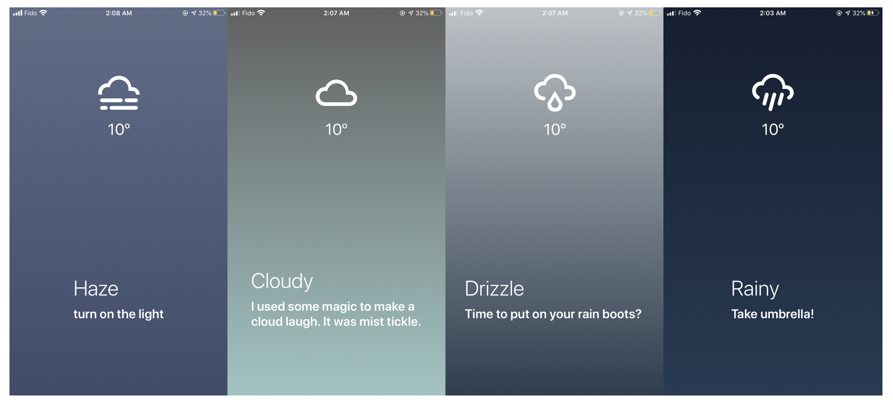
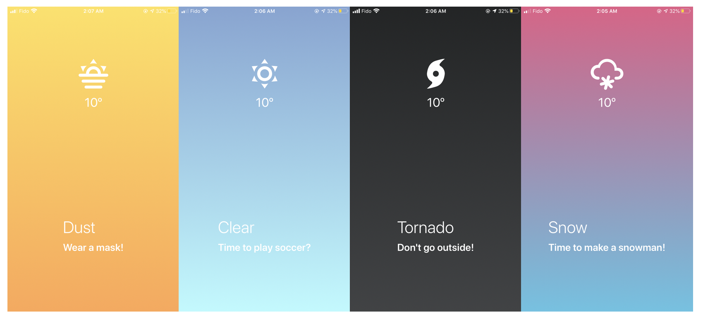

# Weather App

- Built ios app using React Native with expo for learning purpose.
- The app gets geo location of the device and gets weather api from https://openweathermap.org/ and displays weather according to the location.
